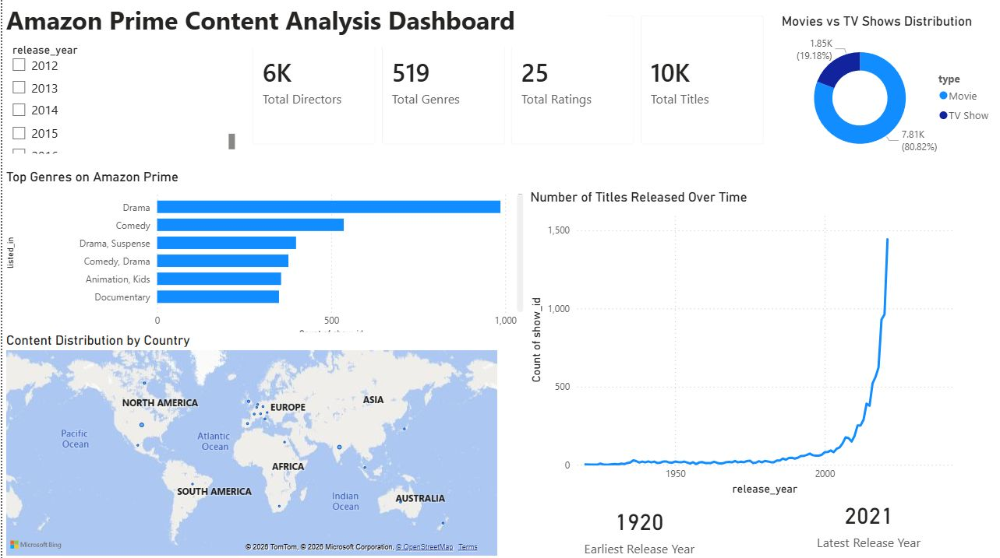

# Amazon Prime Content Analysis Dashboard

## Project Overview
This project analyzes the Amazon Prime titles dataset using Power BI to understand content distribution, release trends, and genre popularity on the platform.

## Tools Used
- Microsoft Power BI
- Data Cleaning
- Data Visualization

## Dashboard Preview

## Key Insights
- Movies dominate Amazon Prime's catalog compared to TV shows.
- Drama is the most common genre on the platform.
- Content production significantly increased after 2015.
- Most content originates from North America.
