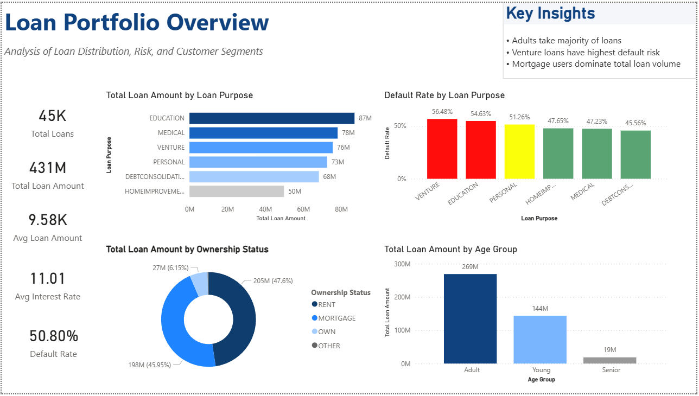
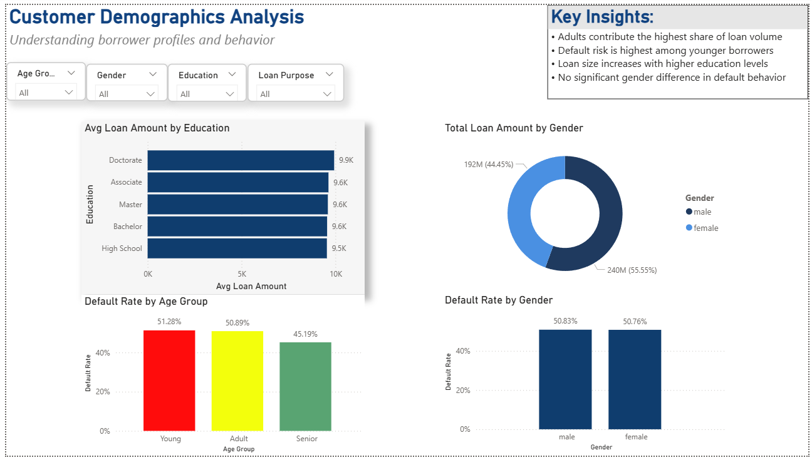
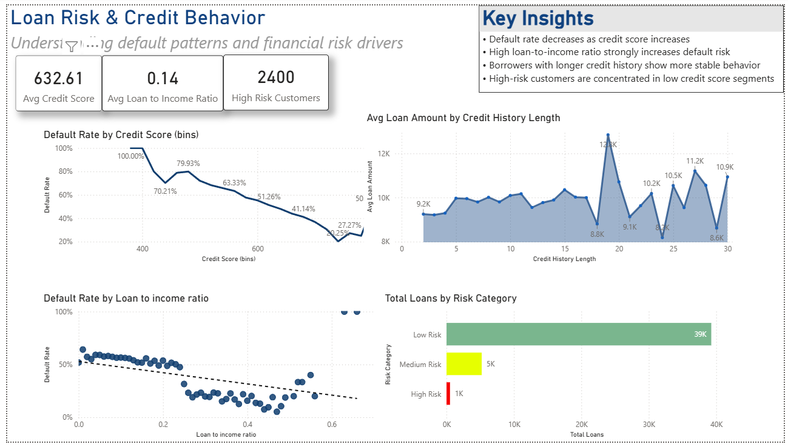

# Loan Risk & Credit Analysis Dashboard

This Power BI project analyzes loan data to identify credit risk patterns, default behavior, and customer borrowing trends.

## Dashboard Pages

### Executive Overview

### Customer Demographics

### Loan Risk & Credit Behavior

## Key Insights
- Default rate decreases as credit score increases
- High loan-to-income ratio increases default risk
- Borrowers with longer credit history show more stable behavior
- High-risk customers are concentrated in low credit score segments

## Files Included
- `loan-risk-powerbi-dashboard.pbix`
- Dashboard screenshots
- `loan_data.csv`

## Tools Used
- Power BI
- DAX
- Power Query
- Data Visualization

## Author
Shahmir Ali
